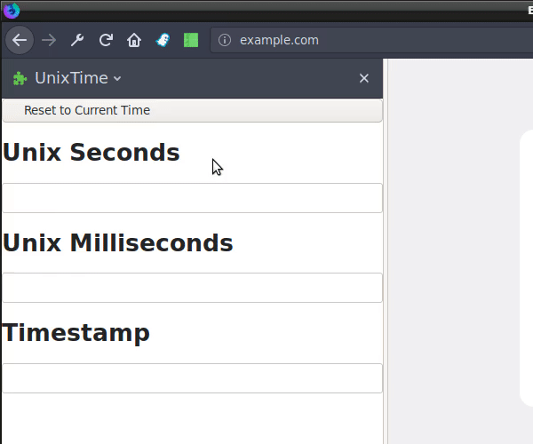

# What is This?

This is a Firefox extension for doing quick conversions between Unix timestamps
(both second and millisecond format) and human-readable date strings.

Unlike sites that do the same conversion, the extension lives in your browser
and is always accessible inside of your sidebar.

# How Can I Use This?

Run the build script that best matches your platform (`build.sh` or
`build.ps1`), which will generate an XPI file in the build directory.

As long as you are using either the Developer or Nighly release channel of
Firefox, you can then drag the generated XPI file into `about:addons` to
install it.

Once it's installed, the simplest way to get to it is to open your sidebar (for
example, using the Bookmarks shortcut `Ctrl+B`) and changing the sidebar page
to UnixTime.

# Images

